# Panduan Penggunaan SITANAH

**Aplikasi Surat Tanah Garapan — Kantor Camat Dumai Timur**

SITANAH membantu petugas kecamatan membuat berkas pengurusan tanah garapan.
Data diisi **satu kali**, aplikasi menghasilkan **3 surat siap cetak**:

1. **Surat Pernyataan Tidak Bersengketa**
2. **Berita Acara Pengukuran Tanah**
3. **Sceets Kaart (Peta Situasi Tanah)**

Tujuan utama aplikasi: **mencegah surat ganda atas bidang tanah yang sama** —
karena surat ganda berujung sengketa. Setiap kali petugas mengisi lokasi dan
batas-batas tanah, aplikasi otomatis memeriksa apakah tanah itu sudah pernah
dibuatkan surat.

---

## Daftar Isi

1. [Menjalankan aplikasi](#1-menjalankan-aplikasi)
2. [Login pertama & ganti password](#2-login-pertama--ganti-password)
3. [Persiapan awal: Data Pejabat & Wilayah](#3-persiapan-awal-data-pejabat--wilayah)
4. [Pengaturan identitas kantor](#4-pengaturan-identitas-kantor)
5. [Membuat berkas baru (5 langkah)](#5-membuat-berkas-baru-5-langkah)
6. [Mencetak 3 surat](#6-mencetak-3-surat)
7. [Peringatan duplikat: merah, kuning, abu-abu](#7-peringatan-duplikat-merah-kuning-abu-abu)
8. [Kasus: warga menjual sebagian tanah (pecah bidang)](#8-kasus-warga-menjual-sebagian-tanah-pecah-bidang)
9. [Kasus: surat induk terbit sebelum aplikasi ada (arsip surat lama)](#9-kasus-surat-induk-terbit-sebelum-aplikasi-ada-arsip-surat-lama)
10. [Mencari berkas](#10-mencari-berkas)
11. [Mengubah berkas](#11-mengubah-berkas)
12. [Latihan dengan data contoh](#12-latihan-dengan-data-contoh)
13. [Backup data](#13-backup-data)
14. [Pertanyaan umum](#14-pertanyaan-umum)

---

## 1. Menjalankan aplikasi

1. Salin `surat-tanah.exe` ke satu folder di komputer kantor, misalnya `D:\SITANAH\`.
2. **Klik dua kali** `surat-tanah.exe`. Tidak perlu instalasi apa pun.
3. Browser terbuka otomatis ke alamat `http://127.0.0.1:8080`.

Yang terjadi di belakang layar:

- File data `surat-tanah.db` dibuat otomatis **di samping exe**. Seluruh data
  tersimpan di file ini — satu file itu saja.
- Aplikasi **hanya bisa diakses dari komputer ini** (tidak lewat jaringan),
  dan **tidak butuh internet** sama sekali.

> Jangan memindah/menghapus `surat-tanah.db`. Kalau exe dipindah folder,
> pindahkan juga file db-nya agar data ikut.

## 2. Login pertama & ganti password

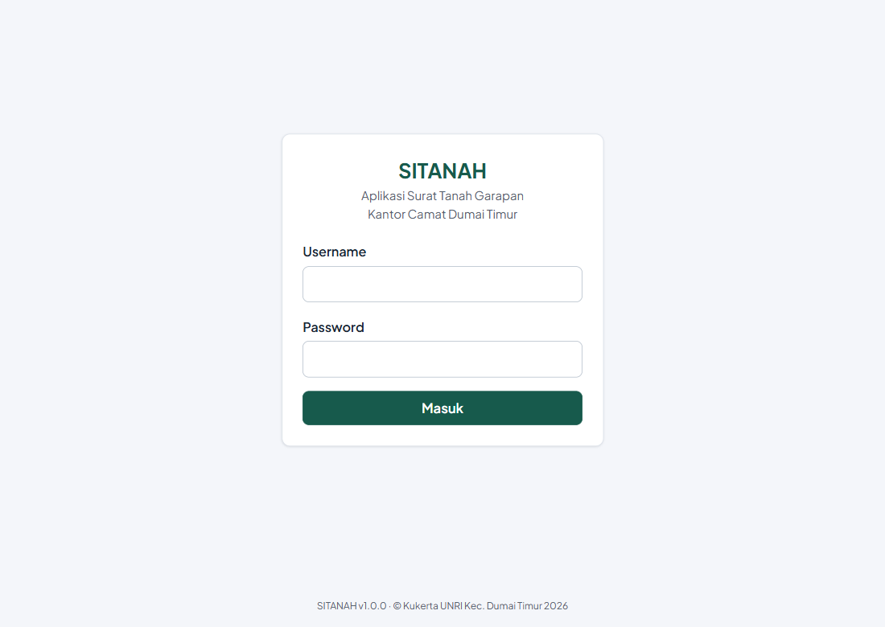

Akun bawaan saat pertama kali dijalankan:

| Username | Password |
|---|---|
| `admin` | `admin123` |

Setelah login pertama, aplikasi **mewajibkan mengganti password** (minimal
6 karakter). Simpan password baru baik-baik — lihat [Pertanyaan umum](#14-pertanyaan-umum)
bila lupa.

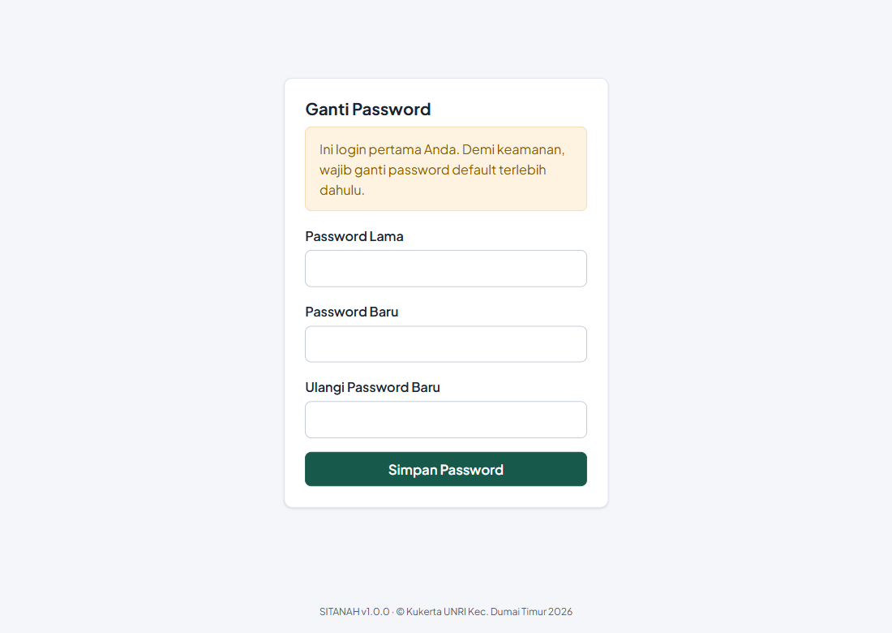

## 3. Persiapan awal: Data Pejabat & Wilayah

Saat data masih kosong, halaman **Daftar Berkas** menampilkan checklist
persiapan. Isi ketiganya dulu supaya bisa dipilih saat membuat berkas:

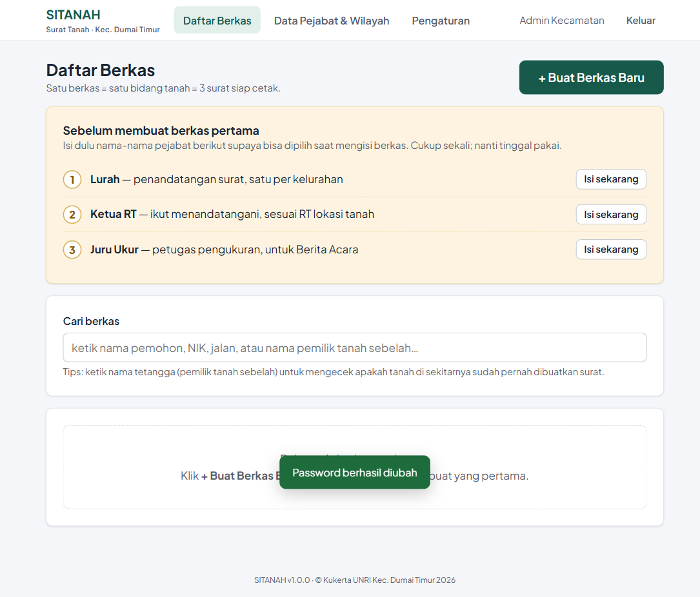

Buka menu **Data Pejabat & Wilayah**. Ada 4 tab:

| Tab | Isi | Catatan |
|---|---|---|
| **Kelurahan** | 5 kelurahan se-Kecamatan Dumai Timur | Sudah terisi otomatis; ubah hanya bila ada pemekaran/ganti nama |
| **Lurah** | Lurah penandatangan surat | **Satu lurah aktif per kelurahan.** Saat lurah berganti, tambahkan yang baru — yang lama otomatis nonaktif |
| **Ketua RT** | Ketua RT per kelurahan | Isi sesuai RT lokasi tanah; bisa ditambah kapan saja |
| **Juru Ukur** | Petugas pengukur tanah | Dua tingkat: **kelurahan** dan **kecamatan** (keduanya tampil di Berita Acara) |

Contoh mengisi Lurah — pilih kelurahan, isi nama dan NIP, klik **Tambah**:

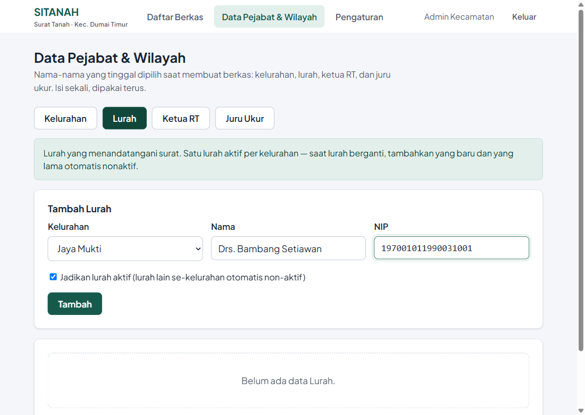

Lakukan hal yang sama untuk Ketua RT (pilih kelurahan, nomor RT, nama):

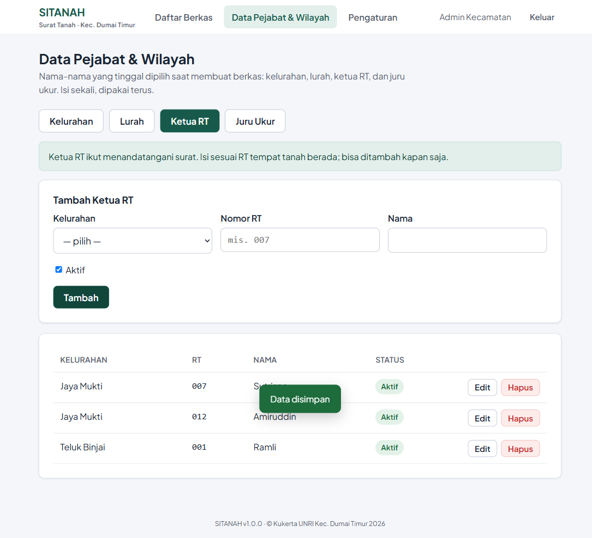

Dan Juru Ukur (pilih tingkat; tingkat kelurahan harus memilih kelurahannya):

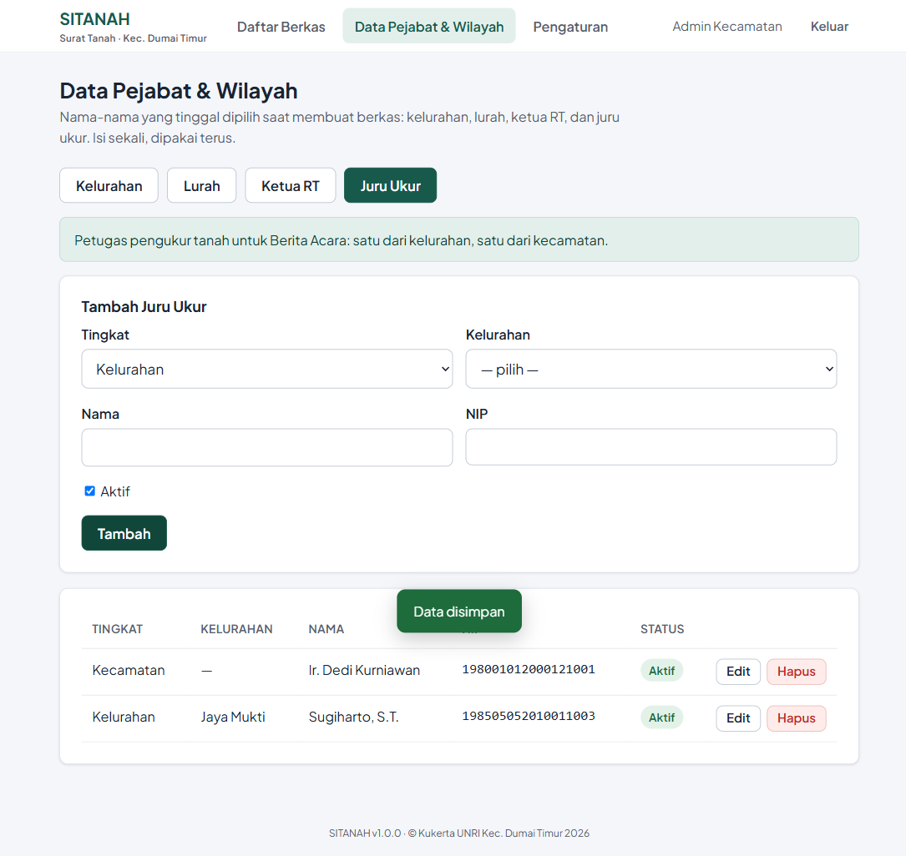

Setelah ketiganya terisi, checklist di halaman depan hilang dengan sendirinya —
aplikasi siap dipakai:

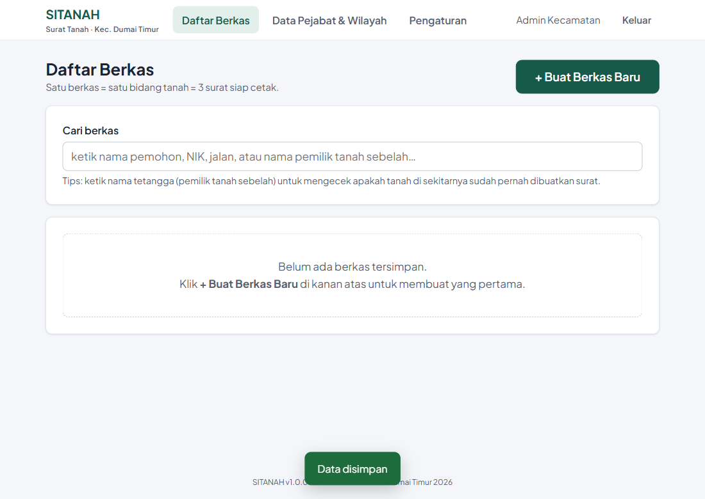

> **Menghapus vs menonaktifkan:** data yang sudah dipakai berkas tidak bisa
> dihapus (aplikasi menolak, agar berkas lama tetap utuh). Gunakan tombol
> **Edit** lalu hilangkan centang **Aktif** — data lama tetap tersimpan tapi
> tidak muncul lagi di pilihan.

## 4. Pengaturan identitas kantor

Menu **Pengaturan** berisi identitas yang tercetak di isi surat (bukan kop —
surat sengaja polos sesuai blangko resmi):

- **Kecamatan** (bawaan: Dumai Timur)
- **Kota** (bawaan: Dumai)
- **Kantor Pertanahan** (bawaan: Kantor Pertanahan Kota Dumai — dipakai di Sceets Kaart)

Nilai bawaan sudah benar untuk Dumai Timur; biasanya tidak perlu diubah.
Di halaman ini juga ada tombol **Ganti Password**.

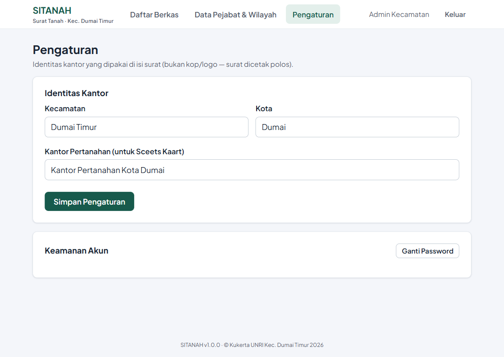

## 5. Membuat berkas baru (5 langkah)

Klik **+ Buat Berkas Baru**. Form dibagi 5 langkah pendek; klik **Lanjut →**
untuk berpindah. Langkah yang sudah dilewati bisa diklik lagi di deretan
angka atas untuk memperbaiki. Tombol **Batal** selalu ada di kiri bawah
(dengan konfirmasi, agar isian tidak hilang karena salah klik).

### Langkah 1 — Pemohon

Data orang yang menggarap tanah (Pihak Pertama): nama sesuai KTP, NIK 16
digit, umur, pekerjaan, alamat.

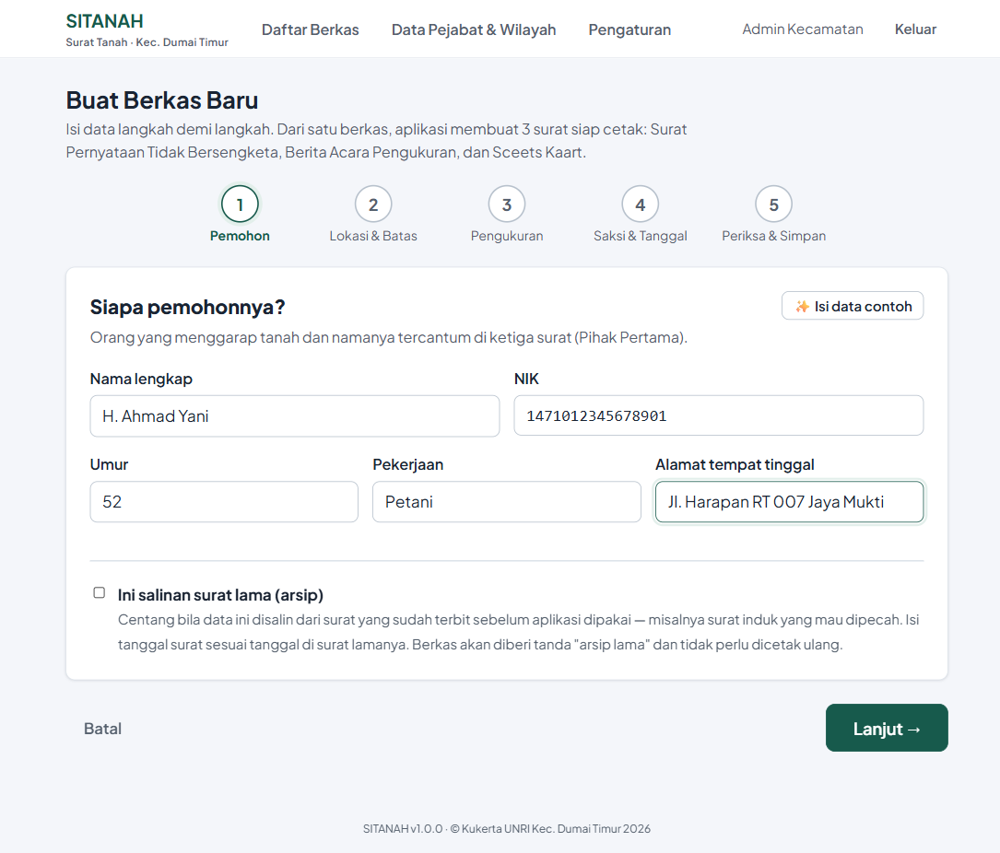

*(Centang "Ini salinan surat lama" di bagian bawah hanya untuk kasus arsip —
lihat [bagian 9](#9-kasus-surat-induk-terbit-sebelum-aplikasi-ada-arsip-surat-lama).)*

### Langkah 2 — Lokasi & batas tanah

Pilih kelurahan, tulis jalan/gang, pilih RT (otomatis menampilkan nama Ketua
RT-nya), isi luas. Lalu isi **batas-batas tanah** pada denah mata angin:
tulis nama pemilik tanah (atau nama jalan/parit) di tiap sisi, seperti
melihat denah dari atas — Utara di atas, Barat–Timur di samping, Selatan di
bawah. Panjang tiap sisi (meter) ikut tercetak di surat.

**Begitu keempat batas terisi, aplikasi otomatis mengecek duplikat** dan
menampilkan hasilnya tepat di bawah denah (panel hijau = aman).

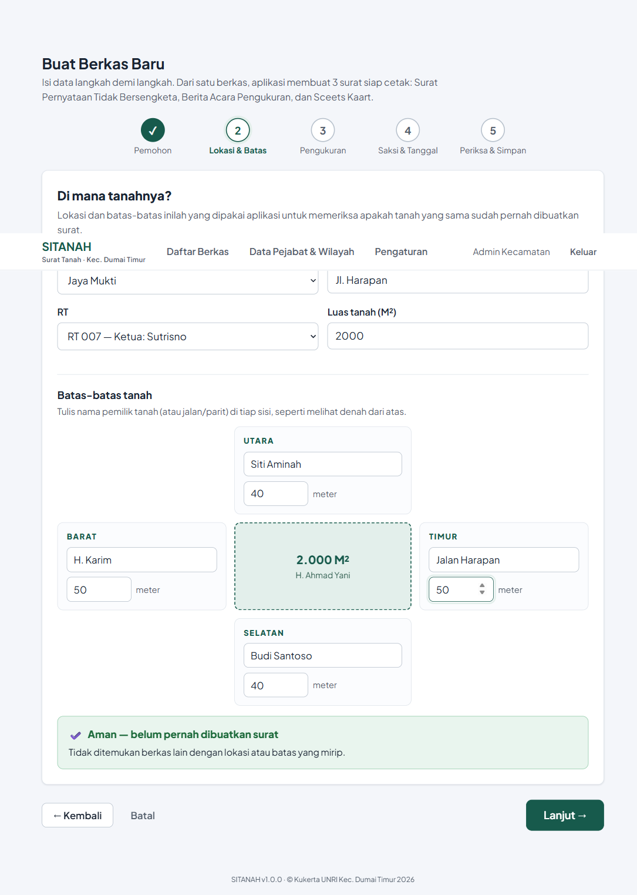

### Langkah 3 — Pengukuran & ganti rugi

Tanggal pengukuran, juru ukur kelurahan & kecamatan, dan Pihak Kedua (yang
mengganti rugi) beserta luas yang diganti rugi. **Semua isian di langkah ini
boleh dikosongkan** — bagian tersebut akan kosong di surat dan bisa diisi
tangan.

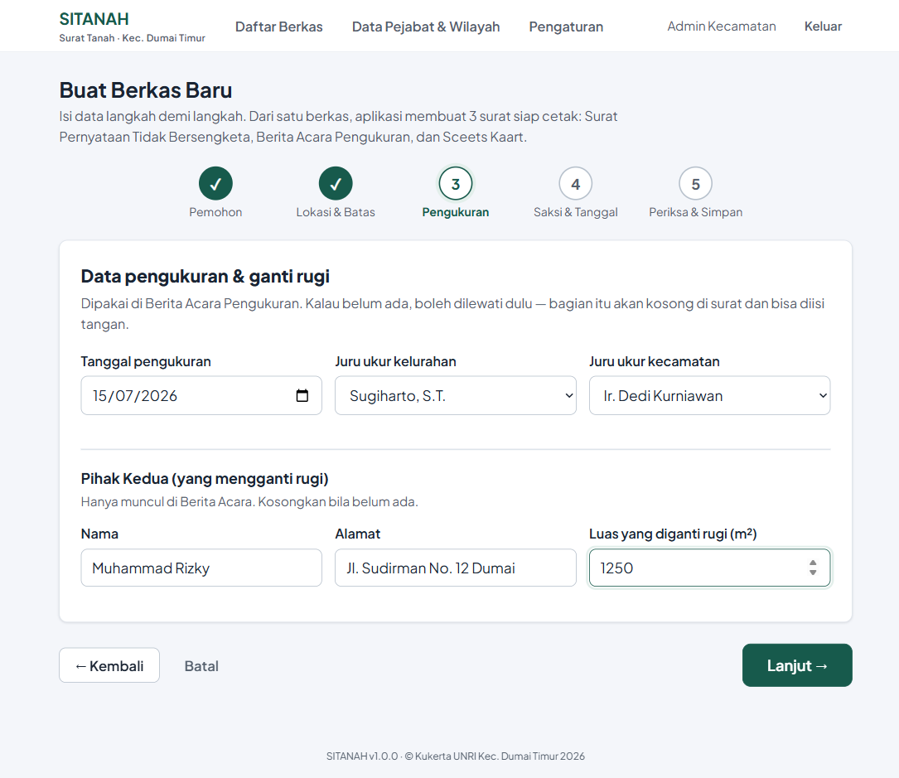

### Langkah 4 — Saksi & tanggal surat

Empat saksi sempadan (biasanya pemilik tanah sebelah) — nama mereka tercetak
di ketiga surat — dan tanggal surat yang tercetak di blok tanda tangan.

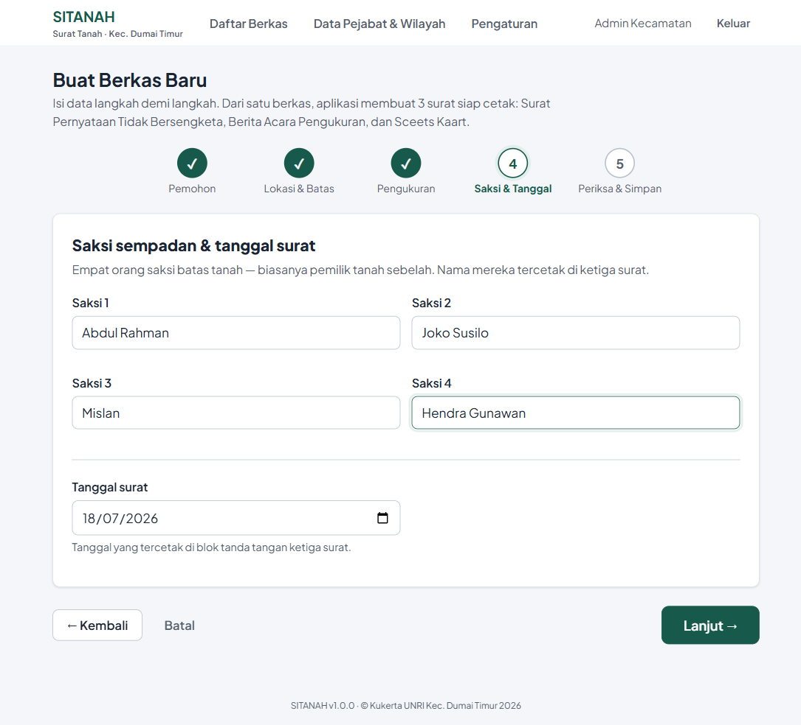

### Langkah 5 — Periksa & simpan

Ringkasan seluruh isian + hasil cek duplikat terakhir. Baca sekali lagi —
data ini akan tercetak di surat resmi. Klik nama langkah di atas untuk
memperbaiki, lalu **Simpan berkas**.

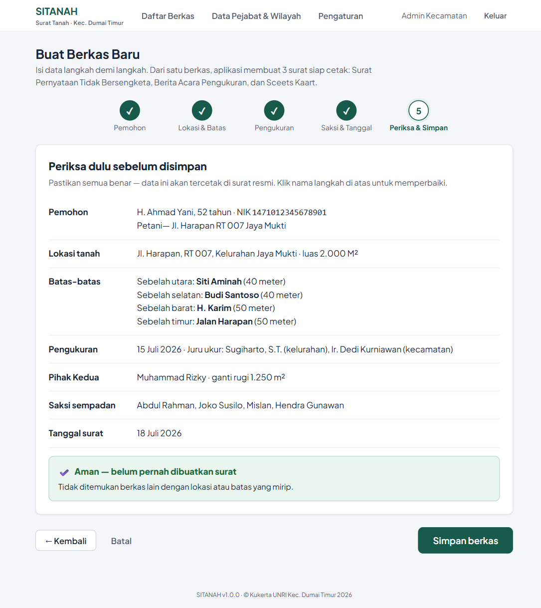

Setelah tersimpan, berkas mendapat **nomor arsip otomatis** (mis. `0001/2026`,
berurutan per tahun). Nomor ini hanya untuk pengarsipan di aplikasi — **tidak
ikut tercetak di surat**, karena blangko resmi memang tidak bernomor.

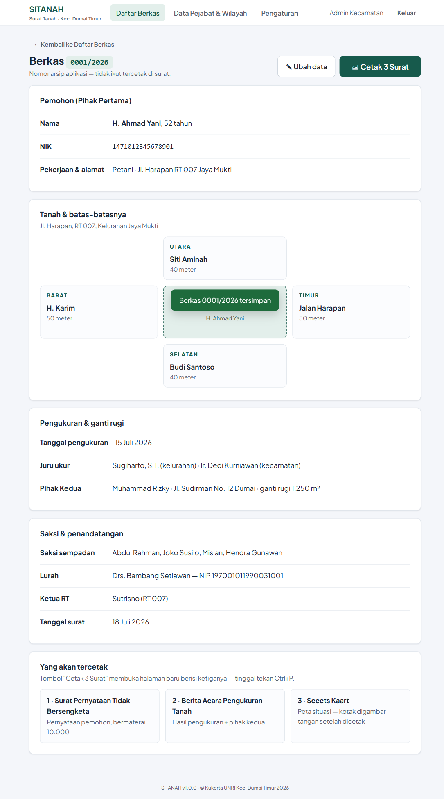

## 6. Mencetak 3 surat

Dari halaman detail berkas, klik **🖨 Cetak 3 Surat**. Tab baru terbuka
berisi ketiga surat sekaligus, masing-masing pas satu halaman A4:

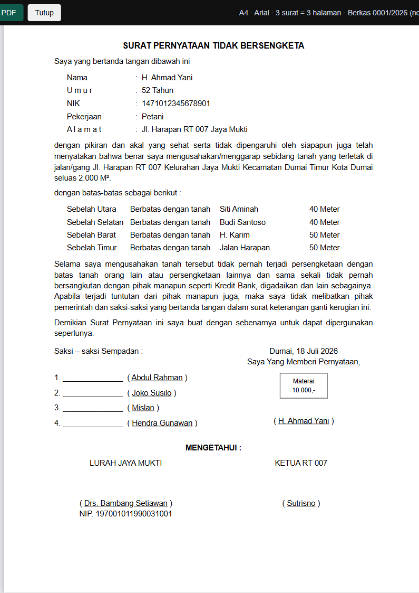

- Klik **Cetak / Simpan PDF** (atau tekan `Ctrl+P`).
- Untuk menyimpan sebagai PDF: pada dialog cetak pilih *Save as PDF*.
- Kotak peta di Sceets Kaart memang **kosong** — digambar tangan setelah
  dicetak, sesuai praktik kantor.
- Isian yang belum ada (mis. juru ukur belum dipilih) tercetak sebagai
  titik-titik untuk diisi tangan.

## 7. Peringatan duplikat: merah, kuning, abu-abu

Inilah inti aplikasi. Saat lokasi + keempat batas terisi (Langkah 2), dan
sekali lagi di Langkah 5, aplikasi membandingkan dengan semua berkas lama:

| Warna | Arti | Yang harus dilakukan |
|---|---|---|
| 🟢 **Hijau (aman)** | Tidak ada berkas mirip | Lanjut biasa |
| ⚪ **Abu-abu** | Ada berkas lain di jalan & RT sama, batas beda | Lihat sekilas, pastikan memang tanah lain |
| 🟡 **Kuning** | Lokasi sama **dan** ≥2 batas cocok | Bandingkan dulu dengan berkas lama sebelum lanjut |
| 🔴 **Merah** | Lokasi dan **keempat batas persis sama** | Hampir pasti tanah yang sama — **buka & cetak ulang berkas lama**, jangan buat baru |

Penulisan nama tidak harus persis sama untuk terdeteksi: `H. Ahmad Yani`,
`HAJI AHMAD YANI`, dan `h.ahmad yani` dianggap orang yang sama; `Jl. Harapan`
dan `Jalan Harapan` dianggap jalan yang sama; `RT 007` sama dengan `7`.

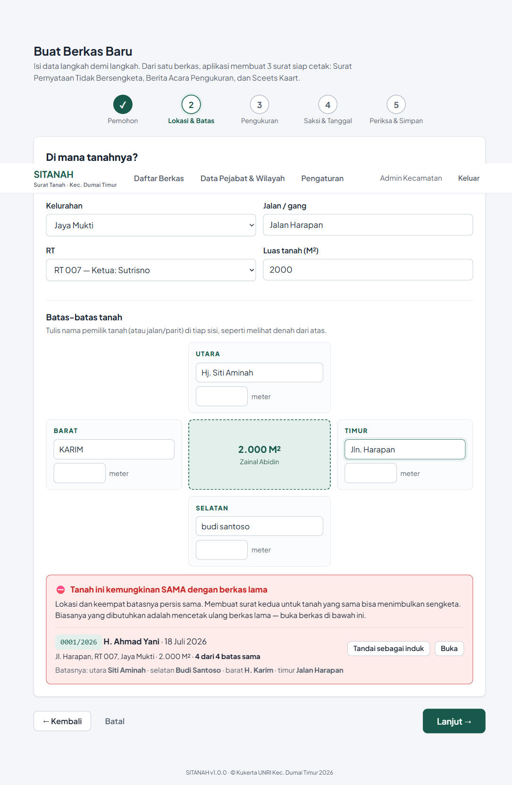

Setiap kandidat menampilkan keempat batasnya + berapa yang cocok, dengan
tombol **Buka** untuk melihat (dan mencetak ulang) berkas lama.

**Bila petugas yakin harus tetap membuat berkas baru** meski merah (contoh:
surat lama hilang/rusak), di Langkah 5 wajib menulis **alasan singkat**:

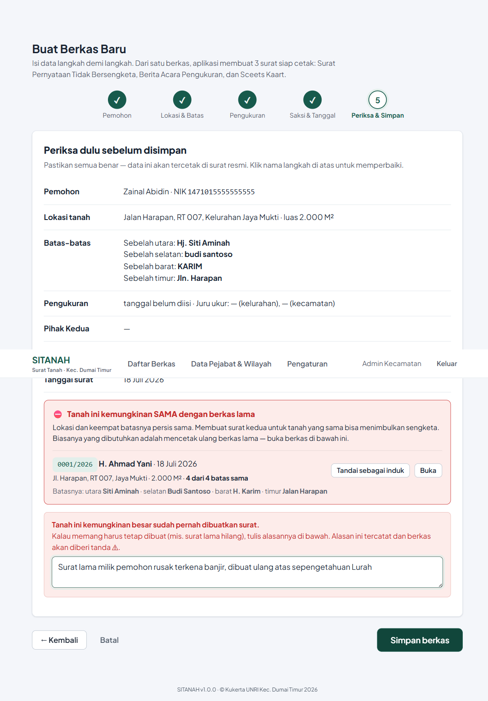

Alasan itu tercatat permanen (siapa & kapan), dan berkas diberi tanda
**⚠ perlu perhatian** di daftar — mudah diaudit di kemudian hari. Tanpa
alasan, aplikasi menolak menyimpan.

## 8. Kasus: warga menjual sebagian tanah (pecah bidang)

Contoh: Pak Ahmad punya tanah 2.000 M² (sudah ada berkasnya), lalu menjual
800 M² bagian selatan ke Pak Budi.

1. Buat berkas baru atas nama Pak Budi seperti biasa.
2. Di Langkah 2, lokasi sama dengan berkas Pak Ahmad → **peringatan kuning
   muncul** dan berkas Pak Ahmad tampil sebagai kandidat. Ini wajar.
3. Klik **"Tandai sebagai induk"** pada berkas Pak Ahmad.

Setelah ditandai:

- Muncul kartu info: luas induk dan **sisa yang belum dipecah**.
- Bila luas yang diisi **melebihi sisa luas induk**, muncul peringatan merah
  dengan hitungannya — periksa kembali angkanya (tetap boleh disimpan bila
  memang benar, misalnya karena luas induk dulu ditulis kira-kira).
- Panel kuning melunak: *"kemiripan dengan induknya memang wajar untuk pecah
  bidang"*.

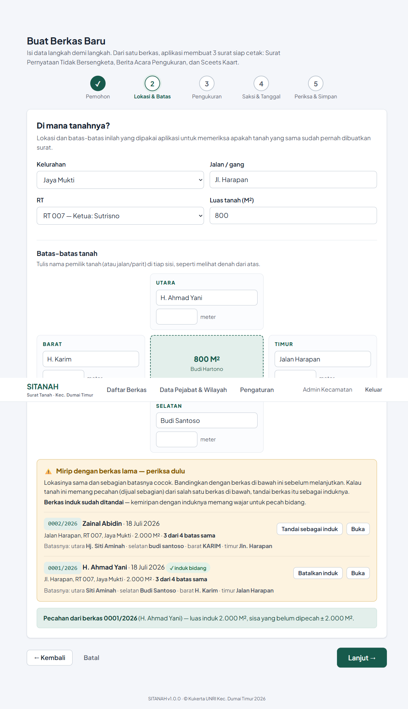

Di halaman detail, hubungan ini tercatat dua arah: berkas pecahan menampilkan
tautan ke induknya, dan berkas induk menampilkan **daftar semua pecahannya**
beserta total dan sisa luas:

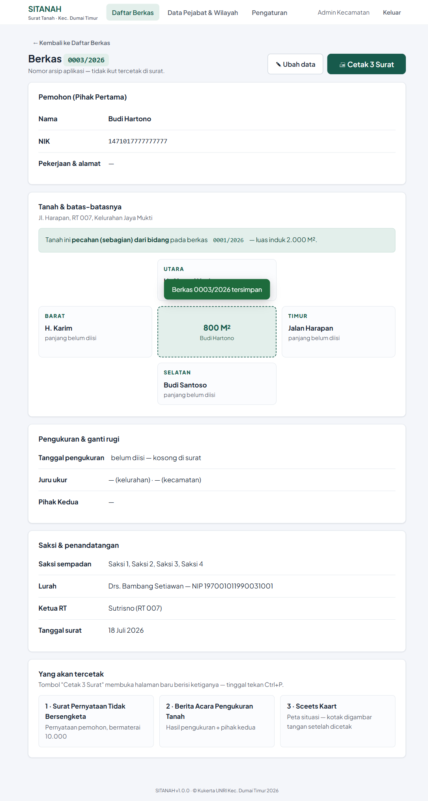

## 9. Kasus: surat induk terbit sebelum aplikasi ada (arsip surat lama)

Aplikasi hanya tahu berkas yang pernah dimasukkan. Surat-surat lama yang
hanya ada di lemari arsip **tidak terdeteksi** — ini keterbatasan alami
sistem baru. Cara menutupnya:

**Saat warga datang membawa surat lama** (misalnya mau memecah tanah),
masukkan dulu surat lama itu sebagai berkas:

1. Buat berkas baru, salin data dari surat kertasnya.
2. Di Langkah 1, centang **"Ini salinan surat lama (arsip)"**.
3. Isi **tanggal surat sesuai tanggal di surat lamanya** — nomor arsip
   otomatis mengikuti tahun surat lama (mis. `0001/2019`), bukan tahun sekarang.
4. Simpan. Tidak perlu dicetak ulang.

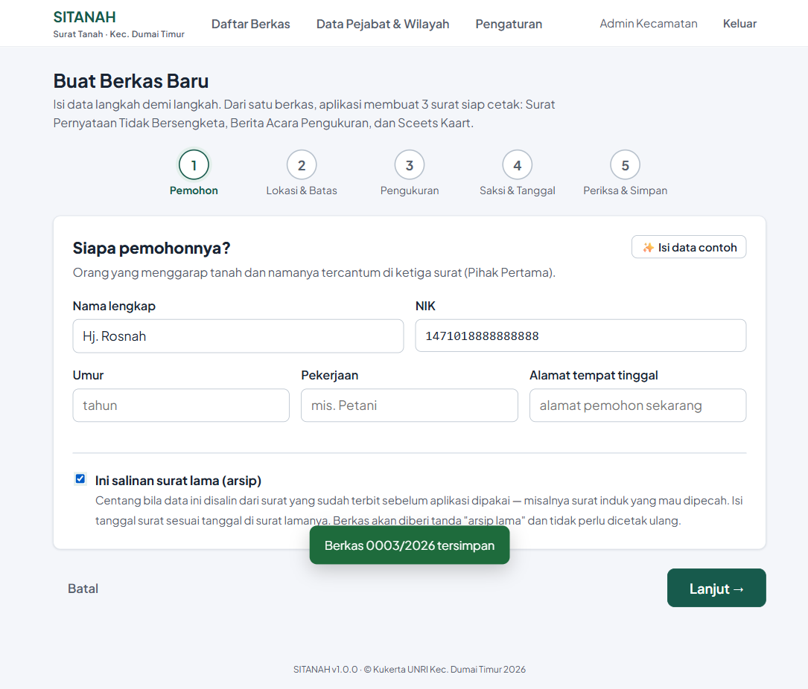

Berkas arsip diberi tanda **🗄 arsip lama** di daftar dan detail, sehingga
terbedakan dari surat yang benar-benar terbit lewat aplikasi. Setelah itu
berkas pecahan bisa dibuat dan induknya ditandai seperti biasa
([bagian 8](#8-kasus-warga-menjual-sebagian-tanah-pecah-bidang)).

Makin banyak surat lama yang lewat meja petugas ikut dimasukkan, makin kuat
deteksi duplikatnya.

## 10. Mencari berkas

Kotak pencarian di Daftar Berkas mencari sekaligus di: **nama pemohon, NIK,
nomor berkas, nama jalan, nama kelurahan, dan nama pemilik batas**.

Kegunaan khusus pencarian nama batas: mengecek *"tanah di sebelah si A sudah
pernah diurus atau belum"*. Ketik nama tetangganya — semua berkas yang
mencantumkan nama itu **sebagai batas** ikut muncul:

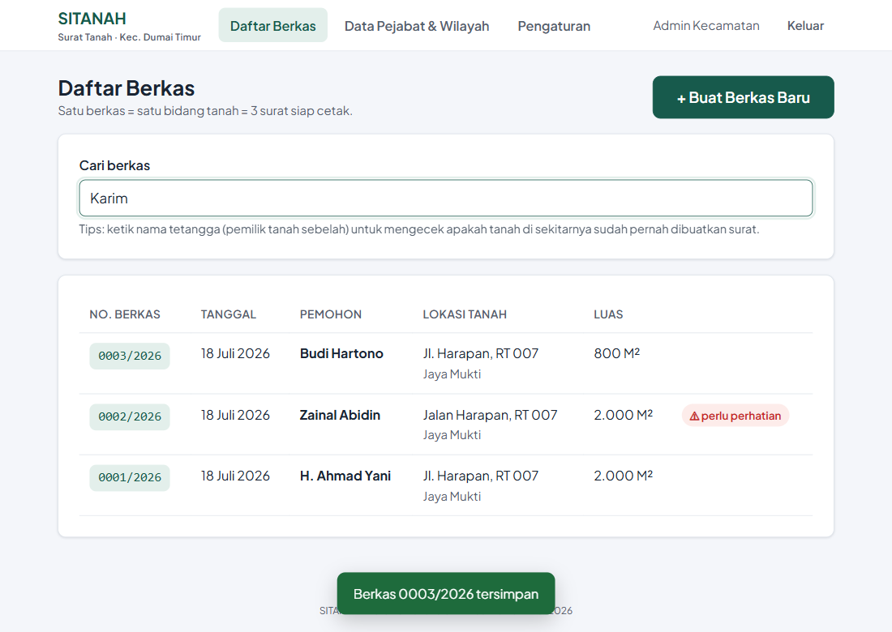

## 11. Mengubah berkas

Buka berkas dari daftar → klik **✎ Ubah data**. Semua langkah bisa langsung
diklik. Berkas tidak dikunci setelah dicetak — tapi setiap perubahan pada
**lokasi atau batas** otomatis memicu **cek duplikat ulang**, dan bila
hasilnya merah, alasan wajib diisi lagi.

## 12. Latihan dengan data contoh

Dua alat bantu untuk latihan (jangan dipakai dengan data sungguhan):

- **Tombol "✨ Isi data contoh"** di Langkah 1 form — mengisi seluruh form
  dengan data fiktif, tinggal ditelusuri lalu disimpan/dibatalkan.
- **Perintah `surat-tanah.exe --seed-contoh`** (jalankan dari Command Prompt
  di folder aplikasi) — mengisi nama contoh Lurah/Ketua RT/Juru Ukur ke
  database yang masih kosong, supaya tidak perlu mengetik master data saat
  mencoba-coba.

## 13. Backup data

Seluruh data ada di **satu file**: `surat-tanah.db` (di folder yang sama
dengan exe).

- **Backup** = tutup aplikasi, salin file itu ke flashdisk/folder lain.
  Biasakan misalnya tiap akhir minggu.
- **Pulihkan** = tutup aplikasi, timpa `surat-tanah.db` dengan file backup,
  jalankan lagi.
- **Pindah komputer** = salin `surat-tanah.exe` + `surat-tanah.db` bersama-sama.

> File `surat-tanah.db-shm` dan `surat-tanah.db-wal` adalah file kerja
> sementara — muncul saat aplikasi berjalan, tidak perlu di-backup
> (tutup aplikasi dulu sebelum menyalin agar semuanya tersimpan rapi).

## 14. Pertanyaan umum

**Browser tidak terbuka otomatis?**
Buka browser apa saja lalu ketik alamat `http://127.0.0.1:8080`.

**Muncul "port terpakai" di log / halaman tidak muncul?**
Kemungkinan aplikasi sudah berjalan (cek ikonnya di taskbar/tray). Aplikasi
otomatis mencari port lain bila 8080 terpakai — lihat alamat yang tertulis
saat aplikasi dijalankan.

**Lupa password admin?**
Tidak ada tombol reset (aplikasi lokal, tanpa email). Hubungi pengelola
aplikasi. Jalan terakhir: ganti `surat-tanah.db` dengan file backup lama
(password mengikuti backup) — atau bila tidak ada backup, hapus
`surat-tanah.db` (⚠ **seluruh data berkas hilang**) lalu jalankan ulang
untuk mulai dari `admin`/`admin123`.

**Apakah bisa diakses dari komputer lain / HP?**
Tidak. Aplikasi sengaja terkunci hanya di komputer tempat ia dijalankan
(alamat 127.0.0.1) demi keamanan data.

**Kenapa nomor berkas tidak tercetak di surat?**
Blangko resmi ketiga surat memang tidak memiliki nomor. Nomor berkas hanya
alat pengarsipan internal aplikasi.

**Data pejabat berganti (lurah baru, RT baru)?**
Tambahkan yang baru di Data Pejabat & Wilayah. Untuk lurah, yang lama
otomatis nonaktif. Berkas lama **tetap memakai nama pejabat saat berkas itu
dibuat** — tidak berubah sendiri.

---

*SITANAH · © Kukerta UNRI Kec. Dumai Timur 2026*
